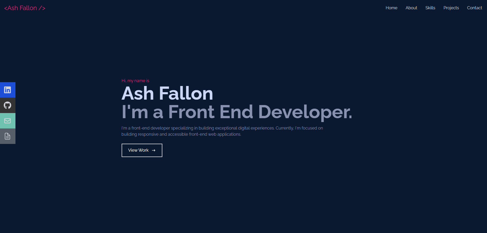
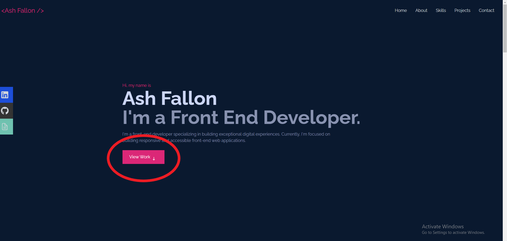
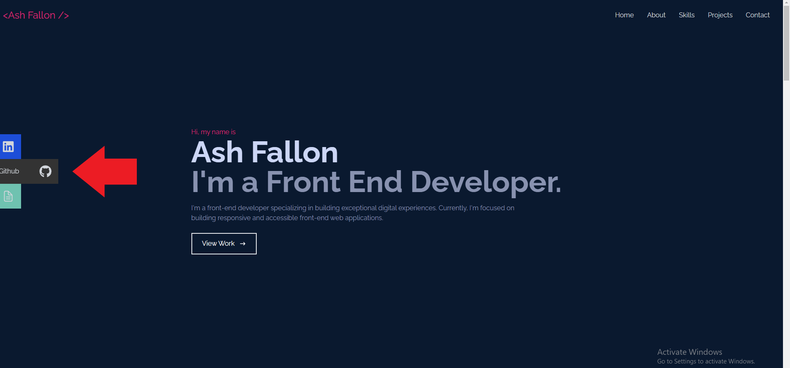
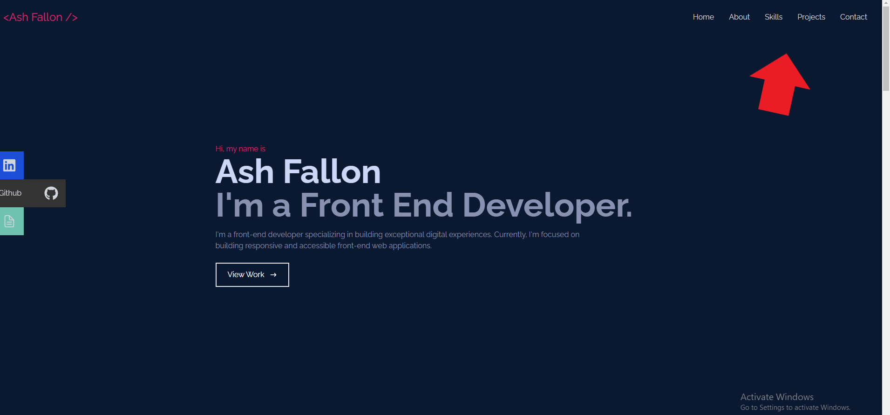
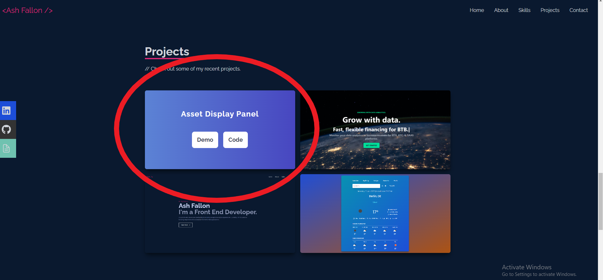
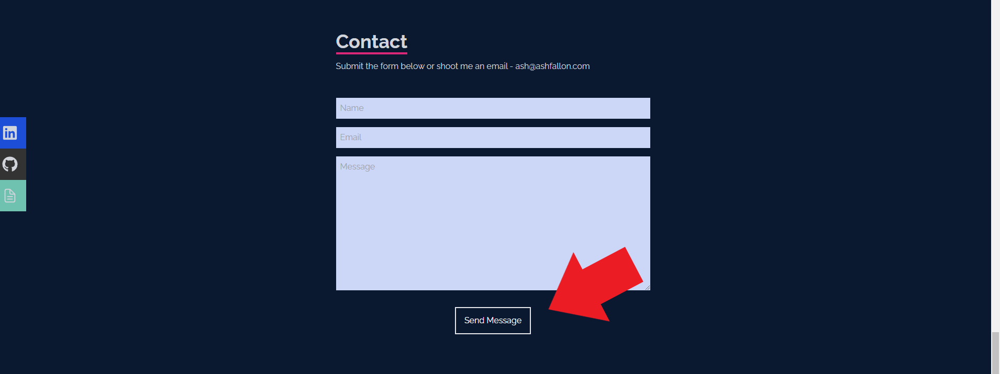

<div id="top"></div>

<h3 align="center">Portfolio Site</h3>

  <p align="center">
    A webpage to show all of my current projects and a hub to find my links and contact me.
    <br />
    <a href="https://github.com/ash-fallon/portfolio-website"><strong>Explore the docs »</strong></a>
    <br />
    <br />
    <a href="https://ashfallon.com">View Demo</a>
    ·
    <a href="https://github.com/ash-fallon/portfolio-website/issues">Report Bug</a>
    ·
    <a href="https://github.com/ash-fallon/portfolio-website/issues">Request Feature</a>
  </p>
</div>

<!-- TABLE OF CONTENTS -->
<details>
  <summary>Table of Contents</summary>
  <ol>
    <li>
      <a href="#about-the-project">About The Project</a>
      <ul>
        <li><a href="#built-with">Built With</a></li>
      </ul>
    </li>
    <li>
      <a href="#getting-started">Getting Started</a>
      <ul>
        <li><a href="#prerequisites">Prerequisites</a></li>
        <li><a href="#installation">Installation</a></li>
      </ul>
    </li>
    <li><a href="#usage">Usage</a></li>
    <li><a href="#roadmap">Roadmap</a></li>
    <li><a href="#contributing">Contributing</a></li>
    <li><a href="#license">License</a></li>
    <li><a href="#contact">Contact</a></li>
    <li><a href="#acknowledgments">Acknowledgments</a></li>
  </ol>
</details>

<!-- ABOUT THE PROJECT -->

## About The Project



<p align="right">(<a href="#top">back to top</a>)</p>

### Built With

- HTML5
- CSS3
- JavaScript
- React
- Tailwind CSS
- Git

<p align="right">(<a href="#top">back to top</a>)</p>

<!-- GETTING STARTED -->

## Getting Started

### Prerequisites

You need to install Node and npm to install this project locally.

- Go to [nodejs.org](https://nodejs.org/en/) and click on the download button (latest or LTS doesn't matter).
- Run the installer.
- Follow the installer steps, agree the license agreement and click the next button.
- You may need to restart your computer, if prompted then do so.
  <br>

Test if you have it installed correctly by running the following in your command line.

```sh
    node -v
```

Test if you have npm.

```sh
    npm -v
```

If you get a version returned on either or both, you have it installed and can move on, if not you may need to refollow the steps listed above.

### Installation

1. Clone the repo
   ```sh
   git clone git@github.com:ash-fallon/asset-display-panel.git
   ```
2. Install NPM packages
   ```sh
   npm install
   ```
3. Run npm start
   ```sh
   npm start
   ```

<p align="right">(<a href="#top">back to top</a>)</p>

<!-- USAGE EXAMPLES -->

## Usage

### Scroll to about section by clicking the View Work button.



### <br> Expand the sidebar buttons by hovering over them.



### <br> Smooth scroll to all sections by clicking navbar buttons at the top.



### <br> Hover over images to find options for demo and code.



### <br> Fill out contact form and press submit button to send me a message!



For more examples, please refer to the [Documentation](https://github.com/ash-fallon/portfolio-website)

<p align="right">(<a href="#top">back to top</a>)</p>

<!-- ROADMAP -->

## Roadmap

- Make button slightly more responsive.
- Add sidebar buttons to mobile site.

<br>See the [open issues](https://github.com/github_username/repo_name/issues) for a full list of proposed features (and known issues).

<p align="right">(<a href="#top">back to top</a>)</p>

<!-- CONTRIBUTING -->

## Contributing

Contributions are what make the open source community such an amazing place to learn, inspire, and create. Any contributions you make are **greatly appreciated**.

If you have a suggestion that would make this better, please fork the repo and create a pull request. You can also simply open an issue with the tag "enhancement".
Don't forget to give the project a star! Thanks again!

1. Fork the Project
2. Create your Feature Branch (`git checkout -b feature/AmazingFeature`)
3. Commit your Changes (`git commit -m 'Add some AmazingFeature'`)
4. Push to the Branch (`git push origin feature/AmazingFeature`)
5. Open a Pull Request

<p align="right">(<a href="#top">back to top</a>)</p>

<!-- LICENSE -->

## License

Distributed under the MIT License. See `LICENSE.txt` for more information.

<p align="right">(<a href="#top">back to top</a>)</p>

<!-- CONTACT -->

## Contact

Ash Fallon - ash@ashfallon.com

Project Link: [https://github.com/ash-fallon/portfolio-website](https://github.com/ash-fallon/portfolio-website)

<p align="right">(<a href="#top">back to top</a>)</p>

<!-- MARKDOWN LINKS & IMAGES -->
<!-- https://www.markdownguide.org/basic-syntax/#reference-style-links -->

[contributors-shield]: https://img.shields.io/github/contributors/github_username/repo_name.svg?style=for-the-badge
[contributors-url]: https://github.com/github_username/repo_name/graphs/contributors
[forks-shield]: https://img.shields.io/github/forks/github_username/repo_name.svg?style=for-the-badge
[forks-url]: https://github.com/github_username/repo_name/network/members
[stars-shield]: https://img.shields.io/github/stars/github_username/repo_name.svg?style=for-the-badge
[stars-url]: https://github.com/github_username/repo_name/stargazers
[issues-shield]: https://img.shields.io/github/issues/github_username/repo_name.svg?style=for-the-badge
[issues-url]: https://github.com/github_username/repo_name/issues
[license-shield]: https://img.shields.io/github/license/github_username/repo_name.svg?style=for-the-badge
[license-url]: https://github.com/github_username/repo_name/blob/master/LICENSE.txt
[linkedin-shield]: https://img.shields.io/badge/-LinkedIn-black.svg?style=for-the-badge&logo=linkedin&colorB=555
[linkedin-url]: https://linkedin.com/in/linkedin_username
[react.js]: https://img.shields.io/badge/React-20232A?style=for-the-badge&logo=react&logoColor=61DAFB
[react-url]: https://reactjs.org/
[tailwind.css]: src/img/tailwind.png
